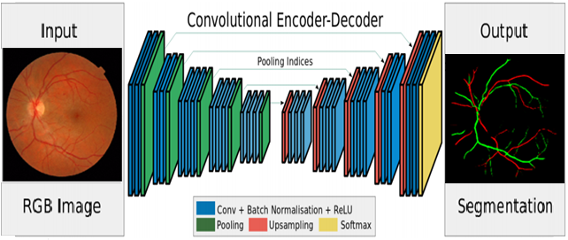

# RetinalNet
Semantic segmentation describes the process of associating every pixel of an image with a class label, 
such as person, animal and in our case artery or vein. This repository provides [DeepLab-Resnet](https://github.com/DrSleep/tensorflow-deeplab-resnet) model for sematic segmentation of arteries and veins trained on retinal images.

 

# Requirements
`Python3`
`Tensorflow`
`Numpy`
`PIL`


# Trained model
Download trained model from [here](https://drive.google.com/drive/folders/1QUUVkQS_DBVpwA_hZrvP4DZIPAVB6SGj?usp=sharing).

# Inference
To perform inference over your own images, use the following command:
```
python3 inference.py /path/to/your/image /path/to/ckpt/file
```
